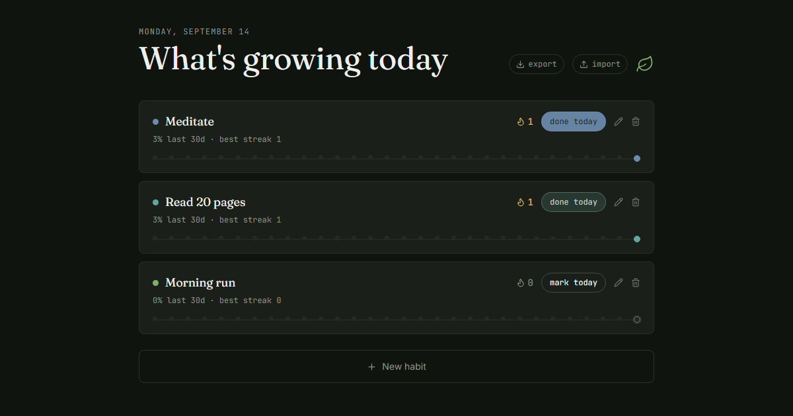

# Habit Dashboard

A small, fast habit tracker: mark days done, watch your streak grow, see a 30-day history at a glance. No backend, no account — everything lives in your browser.

**Live demo:** https://mateovillarroeldev.github.io/habit-dashboard/



## Features

- Add, rename, and delete habits with a color of your choice
- One click to mark a habit done for today, or toggle any of the last 30 days
- Current streak and best-ever streak, plus a 30-day completion rate
- Export your habits to JSON and import them back (useful for backups or moving devices)
- Validated input: no empty or duplicate habit names, and imported files are checked field-by-field before they touch your data
- Persists to `localStorage` — refresh the page and everything's still there
- Fully keyboard- and screen-reader-friendly interactive elements, with reduced-motion support

## Tech stack

- [React 19](https://react.dev/) + [Vite](https://vite.dev/)
- [Tailwind CSS v4](https://tailwindcss.com/)
- [Vitest](https://vitest.dev/) + [Testing Library](https://testing-library.com/) for unit and component tests
- [Oxlint](https://oxc.rs/) for linting
- Deployed to GitHub Pages via [`gh-pages`](https://www.npmjs.com/package/gh-pages)

## Getting started

```bash
npm install
npm run dev
```

## Scripts

| Command | Description |
| --- | --- |
| `npm run dev` | Start the local dev server |
| `npm run build` | Production build to `dist/` |
| `npm run preview` | Preview the production build locally |
| `npm run lint` | Lint the codebase with Oxlint |
| `npm test` | Run the test suite once |
| `npm run test:watch` | Run tests in watch mode |
| `npm run deploy` | Build and publish `dist/` to the `gh-pages` branch |

## Project structure

```
src/
  components/     presentational components (HabitCard, Header, ColorPicker, ...)
  hooks/          useHabits — state, persistence, and CRUD logic
  lib/            pure, unit-tested helpers (dates, streaks, validation)
  constants.js    shared constants (palette, storage key, limits)
```

Data logic (`src/lib`, `src/hooks`) is separated from presentation (`src/components`) specifically so it can be tested without rendering the full UI — see `src/lib/*.test.js` and `src/HabitDashboard.test.jsx`.

## License

[MIT](LICENSE)
